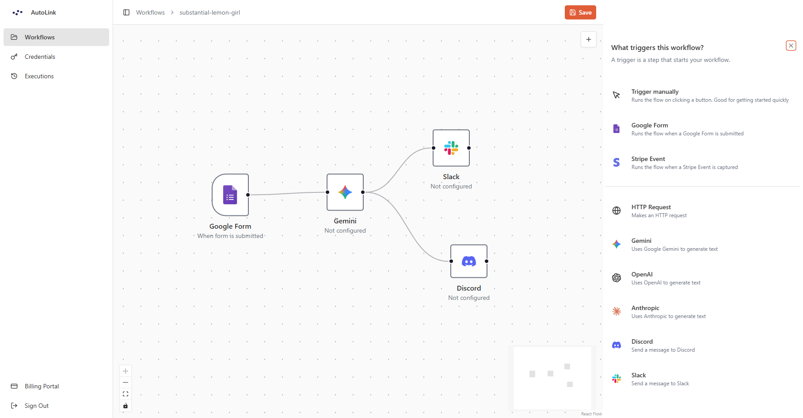

<div align="center">

# Autolink

### Automate anything. Always.

[](https://autolink-snowy.vercel.app)

</div>

---




## 📋 <a name="table">Table of Content</a>

- ✨ [Introduction](#introduction)
- 🧩 [Features](#features)
- 💻 [Tech Stack](#tech-stack)
- ⚙️ [Getting Started](#getting-started)
- 📜 [Available Scripts](#available-scripts)
- 🏗️ [Project Structure](#project-structure)
- 📬 [Contact](#contact)

## <a name="introduction">✨ Introduction</a>

**Autolink** is a visual workflow automation platform where you design, manage, and execute automated workflows using a drag-and-drop editor. Connect triggers, AI models, HTTP requests, and messaging services into powerful automation sequences. No code required.

## <a name="features">🧩 Features</a>

🖼️ **Visual Workflow Editor** — Drag-and-drop canvas powered by React Flow for building automation sequences visually.

📍 **Multi-Trigger Support** — Start workflows with a manual trigger, Google Form submission, Stripe webhook event, and more.

🤖 **AI Node Types** — Integrate Anthropic (Claude), OpenAI (GPT), Google Gemini, and more directly into your workflows.

🌐 **HTTP Request Node** — Make arbitrary HTTP calls to any external API as a workflow step.

💬 **Messaging Nodes** — Send messages to Discord channels or Slack workspaces automatically.

🔐 **Encrypted Credential Storage** — Store and manage API keys per provider with AES encryption.

🕑 **Real-Time Execution Tracking** — Monitor workflow runs live with status, output, and full error logs.

📄 **Execution History** — Browse a paginated history of all past runs per workflow.

🪙 **Subscription Tiers** — Polar-powered premium plan gating advanced features.

🪪 **Authentication** — GitHub & Google OAuth plus email/password sign-in via Better Auth.

and many more, including code architecture and reusability.

## <a name="tech-stack">💻 Tech Stack</a>

| Category             | Technology                                                                                                               |
|----------------------|--------------------------------------------------------------------------------------------------------------------------|
| Framework            | **[Next.js 16](https://nextjs.org/)** (App Router, React Server Components)                                              |
| UI Library           | **[React 19](https://react.dev/)**, **[Shadcn](https://ui.shadcn.com/)**, **[Tailwind CSS 4](https://tailwindcss.com/)** |
| Visual Editor        | **[React Flow](https://reactflow.dev/)** (`@xyflow/react`)                                                               |
| API Layer            | **[tRPC v11](https://trpc.io/)** + **[TanStack React Query v5](https://tanstack.com/query/latest)**                      |
| State Management     | **[Jotai](https://jotai.org/)**                                                                                          |
| Database             | **[PostgreSQL (Neon)](https://neon.com/)** via **[Prisma 7 ORM](https://www.prisma.io/orm)**                             |
| Authentication       | **[Better Auth v1.4](https://better-auth.com/)**                                                                         |
| Subscriptions        | **[Polar](https://polar.sh/)**                                                                                           |
| AI Providers         | **[Vercel AI SDK](https://ai-sdk.dev/)**                                                                                 |
| Background Jobs      | **[Inngest](https://www.inngest.com/)**                                                                                  |
| Encryption           | **[Cryptr](https://github.com/MauriceButler/cryptr)**                                                                    |
| Error Monitoring     | **[Sentry](https://sentry.io/welcome/)**                                                                                 |
| Linting / Formatting | **[Biome](https://biomejs.dev/)**                                                                                        |
| Language             | TypeScript 5                                                                                                             |

## <a name="getting-started">⚙️ Getting Started</a>

> Follow these steps to set up the project locally on your machine.

### 📃 Prerequisites

- [Git](https://git-scm.com/)
- [Node.js](https://nodejs.org/) v18 or higher
- [npm](https://www.npmjs.com/) v9 or higher
- A PostgreSQL database (e.g. [Neon](https://neon.tech))

### 🛠️ Installation & Development

1. #### _Installation_

   ```bash
   # Clone the repository
   git clone https://github.com/AnasAlhwid/autolink.git
   
   # Navigate to the directory
   cd autolink
   
   # Install dependencies
   npm install
   ```

2. #### _Set Up Environment Variables_

   Create a new file named `.env` in the root of your project and add the following content:
    ```env
    # PostgreSQL connection string (e.g. Neon)
    DATABASE_URL=""
    
    # Random secret key for "Better Auth" session signing
    BETTER_AUTH_SECRET=""
   
    # Base URL of the app (e.g. http://localhost:3000)
    BETTER_AUTH_URL=""
   
    # Comma-separated list of allowed origins
    TRUSTED_ORIGINS=""
   
    # GitHub OAuth app client ID
    GITHUB_CLIENT_ID=""
   
    # GitHub OAuth app client secret
    GITHUB_CLIENT_SECRET=""
   
    # Google OAuth client ID
    GOOGLE_CLIENT_ID=""
   
    # Google OAuth client secret
    GOOGLE_CLIENT_SECRET=""
    
    # Sentry auth token for error monitoring
    SENTRY_AUTH_TOKEN=""
    
    # Polar access token for subscription management
    POLAR_ACCESS_TOKEN=""
   
    # Redirect URL after successful Polar checkout (e.g. http://localhost:3000)
    POLAR_SUCCESS_URL=""
    
    # Publicly accessible app URL (e.g. http://localhost:3000)
    NEXT_PUBLIC_APP_URL=""
    
    # Secret key used by Cryptr to encrypt stored credentials
    ENCRYPTION_KEY=""
   
    # Ngrok tunnel URL for local webhook testing
    NGROK_URL=""
    ```

3. #### _Start the development server_

   ```bash
   # Start Next.js server
   npm run dev
   
   # Start Inngest CLI for local webhook testing
   npx inngest-cli@latest dev
   ```

   Open [http://localhost:3000](http://localhost:3000) in your browser. The root path redirects to `/workflows`.

## <a name="available-scripts">📜 Available Scripts</a>

| Command             | Description                                                 |
|---------------------|-------------------------------------------------------------|
| `npm run dev`       | Start the development server at `http://localhost:3000`     |
| `npm run build`     | Production build (runs `prisma generate` then `next build`) |
| `npm run start`     | Start the production server                                 |
| `npm run lint`      | Lint source files with Biome                                |
| `npm run format`    | Auto-format source files with Biome                         |
| `npm run ngrok:dev` | Start an ngrok tunnel for local webhook testing             |

## <a name="project-structure">🏗️ Project Structure</a>

```
prisma/
├── schema.prisma          # Database schema
└── migrations/            # Migration history
public/
└── logos                  # Logo assets
src/
├── app/                   # Next.js App Router
│   ├── (auth)/            # Login & signup pages
│   ├── (dashboard)/
│   │   ├── (editor)/      # Visual workflow editor route
│   │   └── (rest)/        # Workflows, credentials, executions pages
│   └── api/               # API routes (auth, tRPC, Inngest, webhooks)
├── components/            # Shared UI components (shadcn/ui, React Flow)
├── config/                # Node type registry, constants
├── features/              # Feature-scoped logic
│   ├── auth/              # Auth forms
│   ├── credentials/       # Credential CRUD (encrypted API keys)
│   ├── editor/            # Visual editor components & Jotai atoms
│   ├── executions/        # Execution UI & per-node executor components
│   ├── subscriptions/     # Polar subscription integration
│   ├── triggers/          # Trigger node components
│   └── workflows/         # Workflow CRUD, hooks, tRPC routers
|── hooks/                 # Custom hooks 
├── inngest/               # Inngest client, functions, per-node channels
├── lib/                   # Auth, Prisma, Polar, encryption, utilities
└── trpc/                  # tRPC client, server, routers
```

## <a name="contact">📬 Contact</a>


&nbsp;

&nbsp;

&nbsp;


